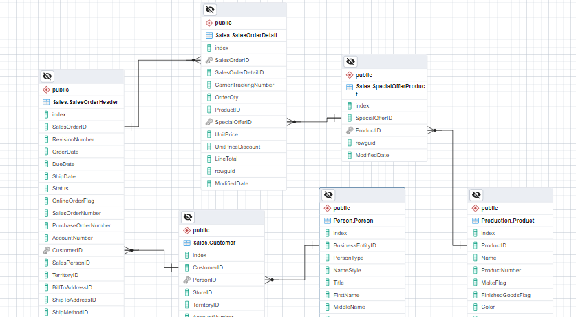
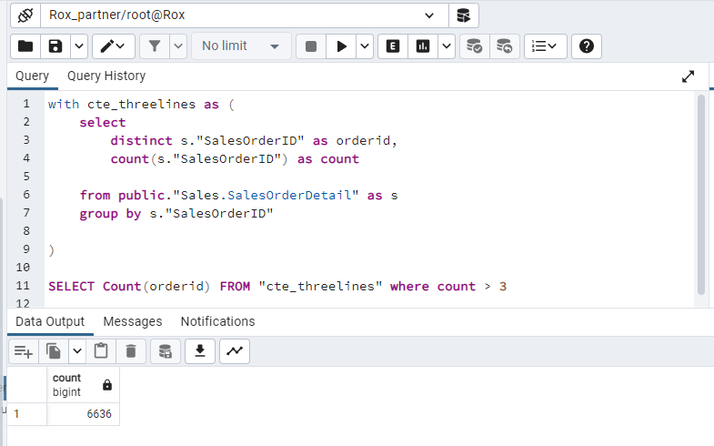
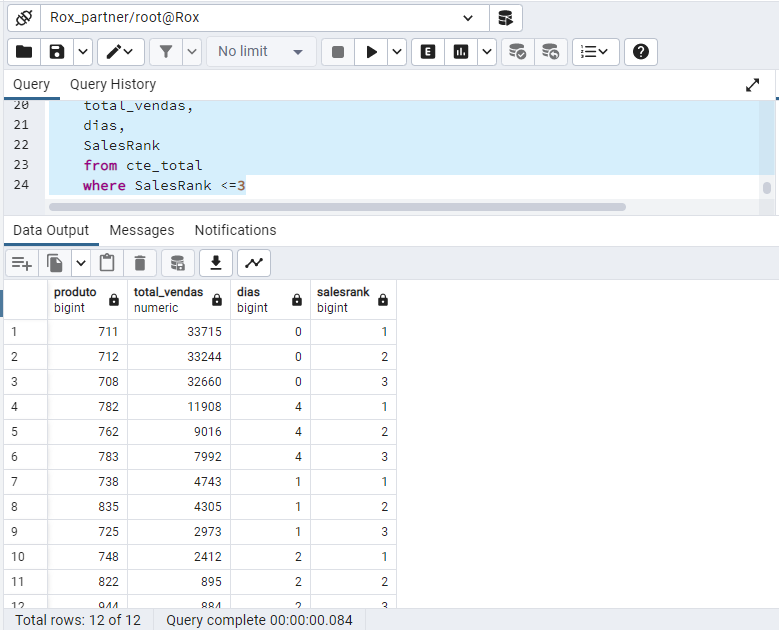
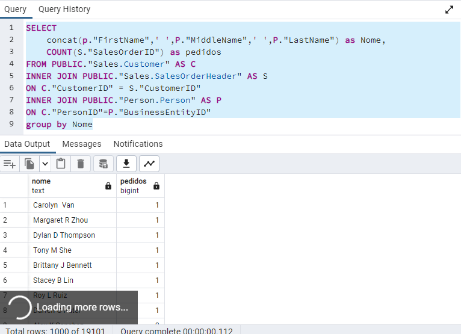
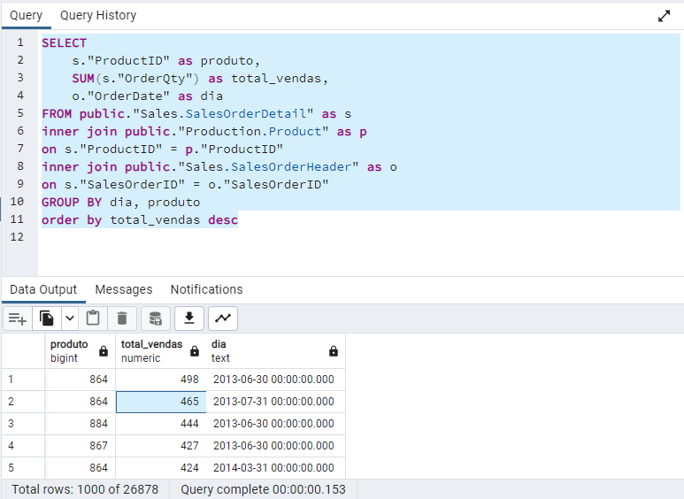
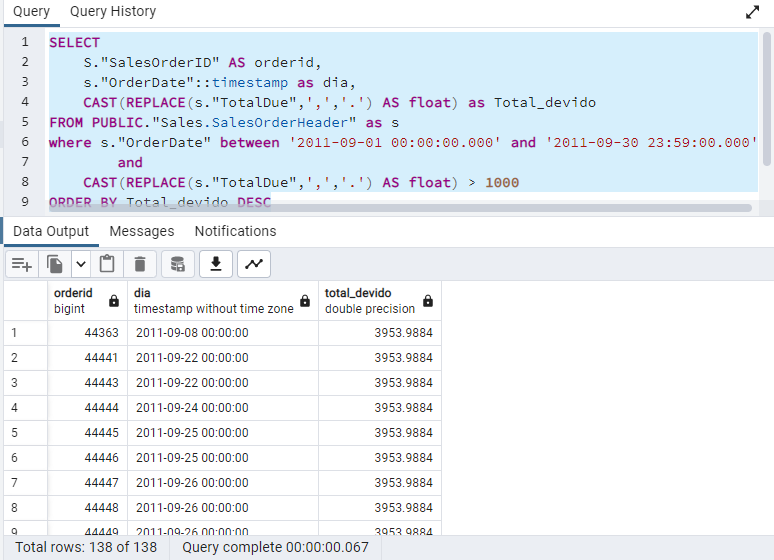
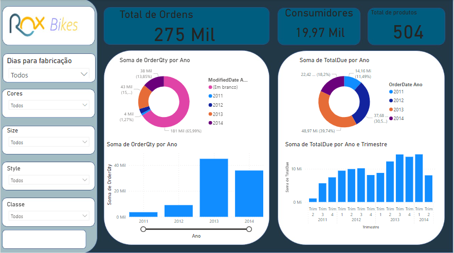

# Solução Rox Partner

## Roxpert: Fernando Yudi Nagao

Objetivos dos Desafios a serem analisados:
 - Modelagem Conceitual dos dados
 - Criação da Infraestrutura necessária;
 - Criação de todos os artefatos necessários para carregar os arquivos para o banco de dados criado;
 - Desenvolvimento de Script para análise de dados;
 - Elaboração de um relatório de visualização de dados.

# Definição da arquitetura:

Como existe a possibilidade de criar a solução em ambiente local, optou-se pela solução com a utlização de containers, que poderão ser exportados para a nuvem, caso necessário. A solução contem um banco de dados relacional open-source (Postgresql), e ferramenta de gestão e desenvolvimento para o Postgresql, PgAdmin. A solução também conta com um script em python com argparse para a ingestão, tratamento, e armazenamento de dados (ETL) dos arquivos .csv necessários. 

Verificando os arquivos csv, em especial o arquivo Person.Person.csv, é possível verificar que há campos em xml. Para extração de tais campos, seria possível utilizar o seguinte exemplo de código:

    name_file = "Person.Person"
    with open(rf"C:\Users\Usuario\Documents\GitHub\Rox\Engenheiro de Dados - CSV\{name_file}.csv") as csv_file:
    reader = csv.reader(csv_file, delimiter=';')
    data = list(reader)
    
    header = next(reader)
    demog_index = header.index('Demographics')
    contact_index = header.index('AdditionalContactInfo')
    print(demog_index)
    demog_data=[]
    for row in reader:
        xml_data = row[demog_index] # assuming the XML data is in the first column
        root = etree.fromstring(xml_data.encode('utf-8'))
        total_purchase_ytd = root.find('{http://schemas.microsoft.com/sqlserver/2004/07/adventure-works/IndividualSurvey}%s' % 'TotalPurchaseYTD').text
        demog_data.append(total_purchase_ytd)
    
    header = data[0] 
    header.append('Total_purchase_ytd')
    for item in range(1,len(data)):
        data[item].append(demog_data[item-1])
    with open(rf"C:\Users\Usuario\Documents\GitHub\Rox\Engenheiro de Dados - CSV\{name_file}1.csv", 'w', newline='') as file:
        writer = csv.writer(file, delimiter=';')
        writer.writerows(data)
    
O snippet acima, cria um novo arquivo Person.Person1.csv, cuja diferença com o arquivo original é o acrescimo de uma nova coluna chamada "Total_purchase_ytd", com os valores extraídos do xml. Contudo, vale a pena ressaltar que os dados referentes a esses campos XML, não interferem em nada com a análise de dados que será explicada posteriormente. Portanto não serão extraídos no atual escopo da solução.  

Para criação do banco Postgresql com a ligação com o Pgadmin, foi utilizado o seguinte comando:

        winpty docker run -it \
        -e POSTGRES_USER="root" \
        -e POSTGRES_PASSWORD="root" \
        -e POSTGRES_DB="Rox_partner" \
        -v C:\\Users\\Usuario\\Documents\\GitHub\\Rox\\Rox_postgres_data:\\var\\lib\\postgresql\\data \
        -p 5432:5432 \
        --network=pg-network \
        --name pg-database \
        postgres:13

        winpty docker run -it \
        -e PGADMIN_DEFAULT_EMAIL="admin@admin.com" \
        -e PGADMIN_DEFAULT_PASSWORD="root" \
        -p 8080:80 \
        --network=pg-network \
        --name pgadmin-2 \
        dpage/pgadmin4

Lembrando que é necessário definir o network para que as duas ferramentas possam ser encontradas. 

        docker network create pg-network
    
Para verificação de criação e ingestão dos arquivos, verificar arquivo ingest_data.py
No terminal, é necessário a parse dos parâmetros:

        py ingest_data.py \
            --user=root \
            --password=root \
            --host=localhost \
            --port=5432 \
            --db=Rox_partner

Para "containeizar" o arquivo ingest_data.py e realizar a passagem dos parâmetros do arquivo, utiliza-se o seguinte comando (verificar dockerfile):

        docker build -t data_ingest:v001 .

E para rodar o container data_ingest:

    docker run -it 
        --network=pg-network
        data_ingest:v001 \
        
        --user=root \
        --password=root \
        --host=pg-database \
        --port=5432 \
        --db=rox_partner

Para facilitar o acesso futuramante e não precisar utilizar dois terminais separados para Postgresql e Pgadmin, utliza-se docker compose para tal. (verificar no repositório docker-compose.yaml).

Resultados:

# Análise de dados
Com base na solução implantada, responda aos seguintes questionamentos:

    Query1 - Escreva uma query que retorna a quantidade de linhas na tabela Sales.SalesOrderDetail pelo campo SalesOrderID, desde que tenham pelo menos três linhas de detalhes.

    Query2 - Escreva uma query que ligue as tabelas Sales.SalesOrderDetail, Sales.SpecialOfferProduct e Production.Product e retorne os 3 produtos (Name) mais vendidos (pela soma de OrderQty), agrupados pelo número de dias para manufatura (DaysToManufacture).

    Query3 - Escreva uma query ligando as tabelas Person.Person, Sales.Customer e Sales.SalesOrderHeader de forma a obter uma lista de nomes de clientes e uma contagem de pedidos efetuados.

    Query4 - Escreva uma query usando as tabelas Sales.SalesOrderHeader, Sales.SalesOrderDetail e Production.Product, de forma a obter a soma total de produtos (OrderQty) por ProductID e OrderDate.

    Query5 - Escreva uma query mostrando os campos SalesOrderID, OrderDate e TotalDue da tabela Sales.SalesOrderHeader. Obtenha apenas as linhas onde a ordem tenha sido feita durante o mês de setembro/2011 e o total devido esteja acima de 1.000. Ordene pelo total devido decrescente

# Respostas

## Query1

Para a solução da query1, utlizou-se CTE (Common Table Expression) para mapear os valores distintos de SalesOrderID e Count deste mesmo valor.
Seleciona os valores dessa query as quais possuem count maior que três:

    with cte_threelines as (
	select 
		distinct s."SalesOrderID" as orderid,
		count(s."SalesOrderID") as count

	from public."Sales.SalesOrderDetail" as s
	group by s."SalesOrderID"

    )

    SELECT Count(orderid) FROM "cte_threelines" where count > 3
Resultados:

## Query2

Para solução da query 2, faz-se join entre as 3 tabelas usando ON ProductID, usa-se novamente uma CTE para a relização da query primária, contendo:
    
    - ProductID, Soma da OrderQty, Dias de Manufatura
    - e Usa-se Rank, para a classificação entre dias de manufatura, da quantidade de orders
A Query final, contem, produto, total_order, dias, com a condicional de SalesRank <=3

    with cte_total as (	
	SELECT
		s."ProductID" as produto,
		SUM(s."OrderQty") as total_vendas,
		p."DaysToManufacture" as dias,
		RANK() OVER (PARTITION BY p."DaysToManufacture" ORDER BY SUM(s."OrderQty") DESC) AS SalesRank
	FROM public."Sales.SalesOrderDetail" as s
	inner join public."Production.Product" as p
	on s."ProductID" = p."ProductID"
	inner join public."Sales.SpecialOfferProduct" as o
	on s."ProductID" = o."ProductID"
	
	GROUP BY p."DaysToManufacture", s."ProductID"
	order by total_vendas DESC, dias
    )	

    SELECT 
        produto,
        total_vendas,
        dias,
        SalesRank
    from cte_total
    where SalesRank <=3
Resultados:

## Query3

Para a solução 3, utiliza-se joins entre as respectivas tabelas e usa-se a função concat() do Postgresql para a junção das Strigs de nome e um count para o número de pedidos, agrupando os valores pelo nome.

    SELECT 
        concat(p."FirstName",' ',P."MiddleName",' ',P."LastName") as Nome,
        COUNT(S."SalesOrderID") as pedidos
    FROM PUBLIC."Sales.Customer" AS C
    INNER JOIN PUBLIC."Sales.SalesOrderHeader" AS S
    ON C."CustomerID" = S."CustomerID"
    INNER JOIN PUBLIC."Person.Person" AS P
    ON C."PersonID"=P."BusinessEntityID"
    group by Nome

## Query4
Utiliza-se join para as devidas colunas e agrupa os itens por produto e dia

    SELECT
        s."ProductID" as produto,
        SUM(s."OrderQty") as total_vendas,
        o."OrderDate" as dia
    FROM public."Sales.SalesOrderDetail" as s
    inner join public."Production.Product" as p
    on s."ProductID" = p."ProductID"
    inner join public."Sales.SalesOrderHeader" as o
    on s."SalesOrderID" = o."SalesOrderID"
    GROUP BY dia, produto
    order by total_vendas desc

## Query5
Utiliza-se uma única tabela na query final. Utiliza-se duas condições: when time stamp do mes de setembro de 2011 e total_devido maior que 1000.

    SELECT
        S."SalesOrderID" AS orderid,
        s."OrderDate"::timestamp as dia,
        CAST(REPLACE(s."TotalDue",',','.') AS float) as Total_devido
    FROM PUBLIC."Sales.SalesOrderHeader" as s
    where s."OrderDate" between '2011-09-01 00:00:00.000' and '2011-09-30 23:59:00.000'
            and
        CAST(REPLACE(s."TotalDue",',','.') AS float) > 1000
    ORDER BY Total_devido DESC

# Relatório Power BI

Utilizou-se o power BI para visualização de algumas métricas pertinentes a emprese produtora de bicicletas.

Contém Cards com as métricas de total de Itens no período selecionado, Total de Clientes e número total de produtos.
Ao lado esquerdo existem os slicers (filtros) de seleção de quantos dias para fabricação, Cor, estilo, Classe e tamanho da Bicicleta. 

No centro da visualização existem os gráficos de Rosca com a quantidade de Itens vendidos e total devido por ano.
Abaixo desses encontram-se os valores por trimestre, podendo-se filtrar por ano também.